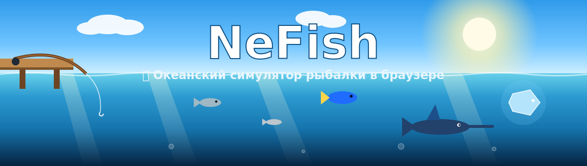
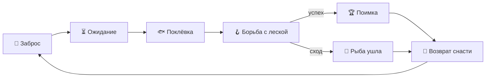

<div align="center">



# 🎣 NeFish

### Современный браузерный симулятор океанской рыбалки

Живой океан, наполненный десятками видов рыб, физический заброс по дуге,
борьба с натяжением лески и красивый стеклянный интерфейс.

<br/>


</div>

---

## 🌊 О проекте

**NeFish** — это казуальная браузерная игра-рыбалка с дневной мультяшно-реалистичной
атмосферой. Вся сцена рисуется на `Canvas` в одном цикле `requestAnimationFrame`,
а интерфейс построен на React с эффектами glassmorphism и анимациями Framer Motion.
Прогресс сохраняется между сессиями в `localStorage`.

> Заброс → ожидание → поклёвка → борьба → поимка/сход → возврат снасти → новый заброс.

---

## ✨ Возможности

| | |
|---|---|
| 🎯 **Заброс по дуге** | Прицеливание мышью (вправо / вниз / влево под причал), шкала силы и пунктирный предпросмотр траектории. Физический полёт крючка, всплеск, круги на воде и звук удара. |
| 🌡️ **Глубина и слои** | Управление глубиной колесом мыши или `W`/`S`. Слои океана и термоклины, индикатор глубины. Максимум зависит от лески и катушки — до самого дна. |
| 🐟 **40+ видов рыб** | Каждый вид — отдельное существо: уникальный силуэт, голова, глаза, плавники, хвост, цвета и анимация. От сардины до Рыбы Тёмной Материи. |
| 🧭 **Живой океан** | Вероятностное распределение по глубине, постоянный роуминг, миграции редких рыб, стаи, охота хищников и избегание препятствий. |
| 🪝 **Борьба с леской** | Мини-игра натяжения и выносливости: рывки, фазы ярости, анти-чит против «зажал и держу». Сложность растёт с редкостью. |
| 🪱 **Система приманок** | 10 типов наживки с анимированными моделями и частицами. Без подходящей приманки рыба не клюёт. Расходуемый ресурс. |
| 🛒 **Магазин и улучшения** | Удочки, катушки, крючки, леска + 8 веток улучшений (скорость, удача, глубина, контроль, инвентарь, наживка…). |
| 🎒 **Инвентарь и коллекция** | Каждая рыба — экземпляр с весом, длиной, ценой и датой. Фильтры, сортировка, продажа. Рекорды по видам сохраняются. |

---

## 🐠 Редкости

<div align="center">


</div>

| Редкость | Поведение | Размер | Примеры |
|---|---|---|---|
| 🩶 **Common** | стаи, серебристый блеск | маленькие | Сардина, Анчоус, Сельдь, Бычок |
| 💚 **Uncommon** | любопытство, рывки | мелкие/средние | Ставрида, Карась, Рыба-лиса, Спинорог |
| 💙 **Rare** | плавное скольжение | средние | Махи-махи, Лунная рыба, Парусник, Помпано |
| 💜 **Epic** | охота, хищники | крупные | Ваху, Каранкс, Барракуда, Наполеон |
| 🧡 **Legendary** | мощь, god-rays | огромные | Белая акула, Марлины, Манта |
| ❤️ **Mythic** | сверхъестественные эффекты | колоссальные | 💎 Алмазная, ☢️ Радиоактивная, 🌌 Тёмная Материя |

---

## 🎮 Управление

| Действие | Клавиша |
|---|---|
| Заброс (прицел + сила) | Зажать **ЛКМ**, целиться мышью |
| Изменить глубину | **Колесо мыши** или **W** / **S** |
| Смотать снасть | **R** |
| Подмотка в борьбе | Зажимать **ЛКМ** (отпускать на рывках!) |
| Магазин / Улучшения / Инвентарь / Коллекция / Приманки | Кнопки в панели справа сверху |

---

## 🚀 Запуск

```bash
# установить зависимости
npm install

# режим разработки → http://localhost:3000
npm run dev

# продакшен-сборка
npm run build && npm start
```

> Требуется **Node.js 18+**.

---

## 🧩 Архитектура

```
NeFish/
├─ app/                    # Next.js App Router (layout, page, globals)
├─ components/
│  ├─ FishingCanvas.tsx    # игровой движок: океан, рыбы, заброс, физика, эффекты
│  ├─ fishRenderer.ts      # уникальная Canvas-отрисовка каждого вида рыб
│  ├─ GameRoot.tsx         # композиция сцены и UI
│  └─ ui/                  # Hud, модалки, мини-игра, иконки (React Icons)
├─ data/                   # контент: fish, bait, rods, shop, upgrades
├─ lib/                    # economy, combat, minigame — игровая логика
└─ store/gameStore.ts      # Zustand store + сохранение в localStorage
```

**Стек:** Next.js 15 · React 19 · TypeScript · Tailwind CSS · Framer Motion · Zustand · Canvas API · React Icons.

---

## 🗺️ Игровой цикл



---

<div align="center">

Сделано с 🌊 и ☕

<sub>Generated with <a href="https://claude.com/claude-code">Claude Code</a></sub>

</div>
